# Табели посещаемости

## 1. О программе

### 1.1. Предназначение

Программное Обеспечение (Программный продукт) предназначено для мобильной регистрации и обмена табелями посещаемости.

### 1.2. Область применения

Программное Обеспечение может использоваться в образовательных учреждениях.

### 1.3. Функциональные возможности
1. Мобильная регистрация табелей посещаемости персон в детсадах и дополнительном образовании.
2. Обмен табелями посещаемости в формате CSV между пользователями либо между пользователем и учётной системой через Telegram или электронную почту.
3. Формирование сводных отчётов по группам и по типам питания для заказа питания.

### 1.4. Текущая версия

2023.1.24

## 2. Жизненный цикл

### 2.1 Нелицензия

```
Это свободное и необременительное программное обеспечение, переданное в 
общественное достояние.

Любой может свободно копировать, изменять, публиковать, использовать,
компилировать, продавать или распространять это программное обеспечение
в виде исходного кода или в виде скомпилированного двоичного файла,
для любых целей, коммерческих или некоммерческих, и любыми средствами.

В юрисдикциях, признающих законы об авторском праве, автор или авторы
этого программного обеспечения передают все авторские права на это
программное обеспечение в общественное достояние. Мы делаем это
в интересах широкой общественности и в ущерб нашим наследникам и преемникам.
Мы намерены, чтобы это посвящение было открытым актом отказа на вечные времена
от всех настоящих и будущих прав на это программное обеспечение в соответствии
с законом об авторском праве.

ПРОГРАММНОЕ ОБЕСПЕЧЕНИЕ ПРЕДОСТАВЛЯЕТСЯ "КАК ЕСТЬ", БЕЗ КАКИХ-ЛИБО ГАРАНТИЙ,
ЯВНЫХ ИЛИ ПОДРАЗУМЕВАЕМЫХ, ВКЛЮЧАЯ, НО НЕ ОГРАНИЧИВАЯСЬ ГАРАНТИЯМИ ТОВАРНОГО
СОСТОЯНИЯ, ПРИГОДНОСТИ ДЛЯ КОНКРЕТНОЙ ЦЕЛИ И НЕНАРУШЕНИЯ ПРАВ. НИ ПРИ КАКИХ
ОБСТОЯТЕЛЬСТВАХ АВТОРЫ НЕ НЕСУТ ОТВЕТСТВЕННОСТИ ЗА ЛЮБЫЕ ПРЕТЕНЗИИ, УБЫТКИ ИЛИ
ДРУГИЕ ОБЯЗАТЕЛЬСТВА, БУДЬ ТО ДОГОВОРНЫЕ, ГРАЖДАНСКО-ПРАВОВЫЕ ИЛИ ИНЫЕ,
ВОЗНИКШИЕ В РЕЗУЛЬТАТЕ, ИЗ ИЛИ В СВЯЗИ С ПРОГРАММНЫМ ОБЕСПЕЧЕНИЕМ,
ИСПОЛЬЗОВАНИЕМ ИЛИ ДРУГИМИ ДЕЙСТВИЯМИ С ПРОГРАММНЫМ ОБЕСПЕЧЕНИЕМ.

Для получения дополнительной информации обратитесь к <https://unlicense.org>
```
### 2.2 Установка

#### 2.2.1 Android

1. Откройте на смартфоне приложение **Play Маркет**.
2. В строке поиска введите **Табели посещаемости**.
3. Выберите и установите приложение разработчика **Павел Никитин**.

Страница приложения в **Google Play** https://play.google.com/store/apps/details?id=ru.parusinf.timesheets

#### 2.2.2 iOS

1. Откройте на смартфоне приложение **App Store**
2. В строке поиска введите **Табели посещаемости**
3. Выберите и установите приложение разработчика **Pavel Nikitin**

Страница приложения в **App Store** https://apps.apple.com/ru/app/id1548110226

#### 2.2.3 Windows 10

1. Скачайте и разархивируйте файл http://timesheets.parusinf.ru/windows/timesheets-windows.zip
2. Установите **Распространяемый пакет Visual C++ для Visual Studio 2015-2022** http://timesheets.parusinf.ru/windows/VC_redist.x64.exe
3. Запустите **timesheets/timesheets.exe** (если SmartScreen блокирует запуск, нажмите **Всё равно выполнить**)
4. Закрепите ярлык на панели задач

#### 2.2.4 Android через RuStore

1. Скачайте и установите на телефоне RuStore, если он ещё не установлен https://rustore.ru/download
2. Установите приложение **Табели посещаемости** https://apps.rustore.ru/app/ru.parusinf.timesheets

#### 2.2.5 Android через apk

1. Скачайте и установите на телефоне apk-файл http://timesheets.parusinf.ru/android/timesheets.apk
2. При сообщении **Заблокировано Play Защитой** нажмите кнопку **ВСЕ РАВНО УСТАНОВИТЬ**.
3. При необходимости включите в настройках Android разрешение на установку из неизвестных источников.

#### 2.2.6 Linux

1. Скачайте и разархивируйте файл http://timesheets.parusinf.ru/linux/timesheets.zip
2. Запустите **timesheets/timesheets**

> если ссылка не открывается, скопируйте и вставьте её в отдельное окно браузера

### 2.3. Обмен табелями с учётной системой Парус

#### 2.3.1. Получение табелей

1. Добавьте огранизацию с ИНН
2. Добавьте группу с мнемокодом в точности как в Парусе
3. Нажмите кнопку **Действия** (справа вверху), **Получить** (стрелочка вниз)

#### 2.3.2. Отправка табелей

1. Заполните табель посещаемости
2. Нажмите кнопку **Действия** (справа вверху), **Отправить** (стрелочка вверх)

> Организация должна использовать приложение **Расчёт оплаты услуг учреждений** для использования интеграции с **Парусом**

#### 2.3.3. Получение и отправка табелей вручную

1. Чтобы не вводить в приложении группы вручную, выгрузите их из Паруса: Учёт, Табель посещаемости, на группе, которую нужно выгрузить, правая кнопка мыши, Обмен, Экспорт в файл, укажите каталог на компьютере, куда выгружать CSV файл группы, пользовательская процедура ВыгрузкаТабеля.
2. Передайте CSV файл на телефон через почту или Telegram.
3. На телефоне откройте CSV файл приложением Табели посещаемости либо в самом приложении нажмите кнопку загрузки и выберите CSV файл.
4. Выгрузите заполненный табель группы из приложения в CSV файл.
5. Передайте CSV файл на компьютер через почту или Telegram.
6. Загрузите CSV файл в Парус: Учёт, Табель посещаемости, правая кнопка мыши, Обмен, Импорт из файл, укажите CSV файл на компьютере, который нужно загрузить, пользовательская процедура ЗагрузкаТабеля.

### 2.4. Процессы, обеспечивающие поддержание жизненного цикла Программного Обеспечения

ТЕХНИЧЕСКАЯ ПОДДЕРЖКА обеспечивает процедуры по оцениванию и осуществлению:
1. обновления
2. местоположения ошибок
3. исправления, носимые в исходные коды
4. консультирование по использованию приложения

### 2.5. Устранение неисправностей, выявленных в ходе эксплуатации Программного Обеспечения

ТЕХНИЧЕСКАЯ ПОДДЕРЖКА обеспечивает процедуры для решения проблем функционирования Программного Обеспечения:
1. получения проблемы
2. документирования проблемы
3. оценивания проблемы
4. принятия решения по проблеме
5. отслеживания решения проблемы:
* через мессенджеры Telegram и WhatsApp _+7 (916) 070-44-94_
* через телеграм-бот https://t.me/timesheets_support
* по обратной связи в системе регистрации проблем https://github.com/parusinf/timesheets/issues
* по электронной почте _pavel@parusinf.ru_

Обратная связь документируется и оценивается с целью определения существования проблемы в выпущенном программном обеспечении. Любая такая проблема регистрируется в Отчёте о проблемах. Отчёт о проблемах включает в себя фактические или потенциальные неблагоприятные события и отклонения от спецификации.

## 3. Процессы совершенствования

ИЗГОТОВИТЕЛЬ осуществляет анализ модификации Программного Обеспечения:
1) документирует и оценивает обратную связь;
2) осуществляет мониторинг обратной связи выпущенного Программного Обеспечения от пользователей;
3) оценивает и одобряет Запросы на изменения, которые модифицируют выпущенное Программное Обеспечение;
4) использует программный процесс разработки или установленный процесс ТЕХНИЧЕСКОЙ ПОДДЕРЖКИ для осуществления модификации Программного Обеспечения.

## 4. Информация о персонале

Информация о персонале, необходимом для обеспечения поддержания жизненного цикла Программного Обеспечения:

* Создание
* Техническая поддержка
* Совершенствование

выполнялись и осуществляются в настоящий момент силами ИЗГОТОВИТЕЛЯ - индивидуального предпринимателя Никитина Павла Александровича, который обладает необходимым набором знаний для работы со всеми компонентами, входящими в состав Программного Обеспечения, при решении прикладных задач, соответствующих функционалу Программного Обеспечения.

## 5. Стоимость технической поддержки

* Стоимость технической поддержки табелей посещаемости для образовательного учреждения составляет **3000 рублей в год**
* Техническая поддержка осуществляется на условиях публичной оферты http://timesheets.parusinf.ru/docs/Публичная_оферта_Техподдержка_Табели_посещаемости.pdf
* Электронная подпись публичной оферты http://timesheets.parusinf.ru/docs/Публичная_оферта_Техподдержка_Табели_посещаемости.pdf.sig
* Заявка на техническую поддержку табелей посещаемости https://forms.yandex.ru/u/63050a5e43076bbe6eced6ca/

## 6. Ссылки

### 6.1. Реестры

* RuStore https://apps.rustore.ru/app/ru.parusinf.timesheets
* Единый реестр российских программ для ЭВМ и баз данных https://reestr.digital.gov.ru/reestr/339496/
* Роспатент https://www1.fips.ru/ofpstorage/Doc/PrEVM/RUNWPR/000/002/021/613/419/2021613419-00001/DOCUMENT.PDF

### 6.2. Нормативные документы

При внедрении задач по автоматизации и создании проектно-эксплуатационной документации ИЗГОТОВИТЕЛЬ руководствуется требованиями следующих нормативных документов:

* ГОСТ 34.602-89. Техническое задание. Требования к содержанию и оформлению.
* ГОСТ 34.201-89. Информационная технология. Комплекс стандартов на автоматизированные системы. Виды, комплексность и обозначение документов при создании автоматизированных систем.
* РД 50-34.698-90. Информационная технология. Комплекс стандартов и руководящих документов на автоматизированные системы. Требования к содержанию документов.
* ГОСТ 34.603-92. Информационная технология. Виды испытаний автоматизированных систем.

## 7. Использование

### 7.1 Жесты

* Выбор: _нажатие_
* Редактирование: _двойное нажатие_
* Удаление: _мах влево или вправо_

### 7.2 Действия

* Отправить табель
* Получить табель из Паруса
* Получить табель из файла

### 7.3 Настройки

* Двойное нажатие в табеле: _Нет_
* Интеграция с Парусом: _Да_
* Пропуски по болезни: _Да_
* Действие `Стереть все данные` удаляет все записи из всех таблиц в локальной базе данных приложения

### 7.4 Демо
Видео-демонстрация https://youtu.be/vvLaug6BrWo

### 7.5 Обучение

#### 1. Добавьте организацию


#### 2. Добавление организации

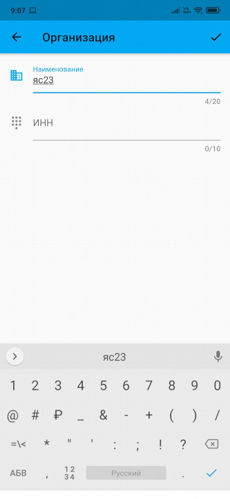

#### 3. Добавьте группу


#### 4. Добавление группы

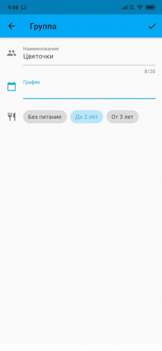

#### 5. Добавьте график


#### 6. Добавление графика

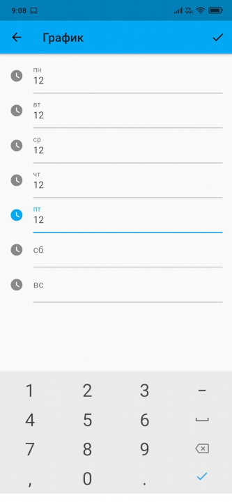

#### 7. Выберите график


#### 8. Выберите питание в группе

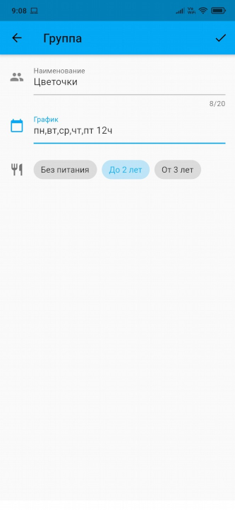

#### 9. Добавьте персону в группу

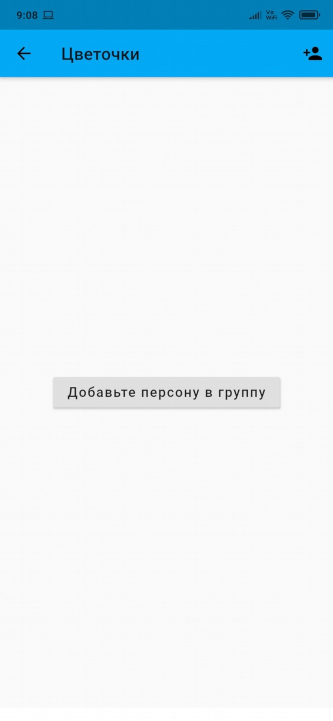

#### 10. Прикрепите персону к группе

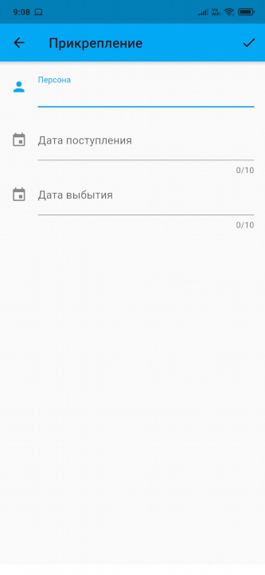

#### 11. Добавьте персону


#### 12. Добавление персоны

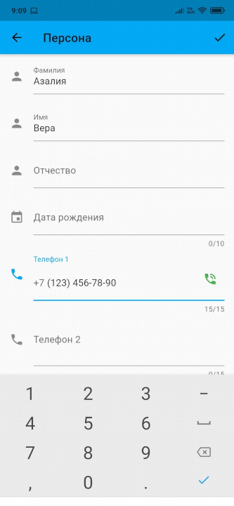

#### 13. Звонок персоне из приложения

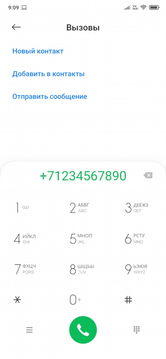

#### 14. Выберите персону


#### 15. Определите срок прикрепления

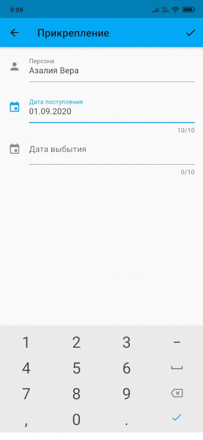

#### 16. Список персон в группе

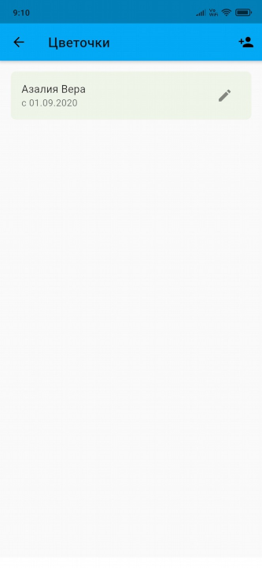

#### 17. Выберите месяц

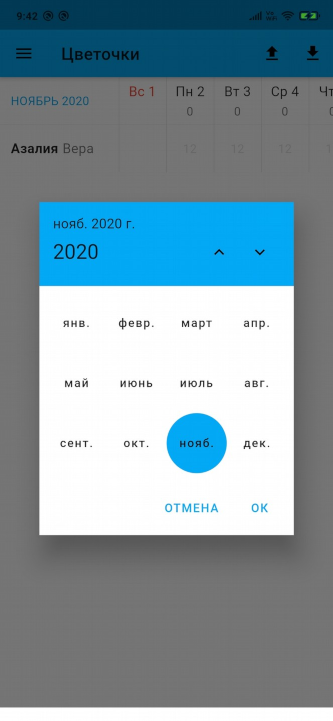

#### 18. Заполните табель посещаемости

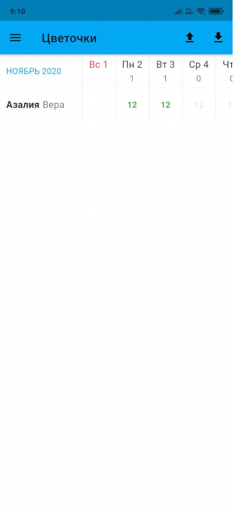

#### 19. Отправьте табель через Telegram

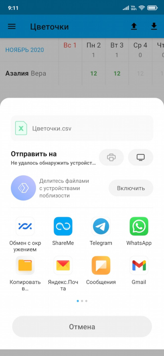

#### 20. Выберите получателя


#### 21. Удалите посещаемость

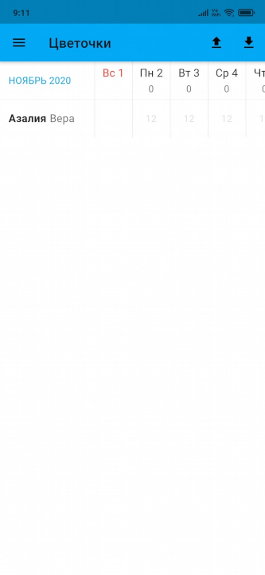

#### 22. Удалите персону из группы

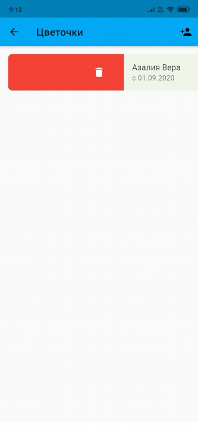

#### 23. Удалите группу

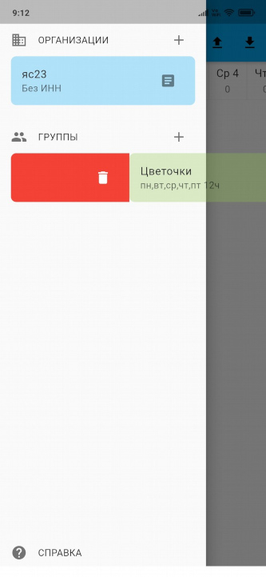

#### 24. Удалите организацию

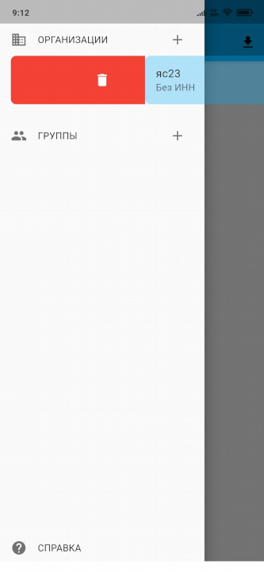

#### 25. Откройте Telegram


#### 26. Нажмите на файл в Telegram

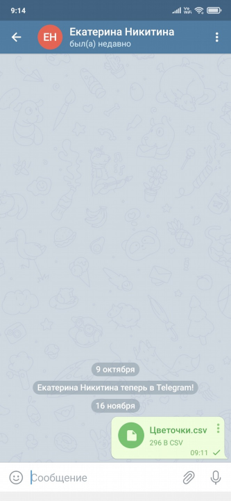

> _Для iPhone файл нужно сохранить из Telegram на телефон, затем загрузить его в приложении._

#### 27. Загруженный из Telegram табель

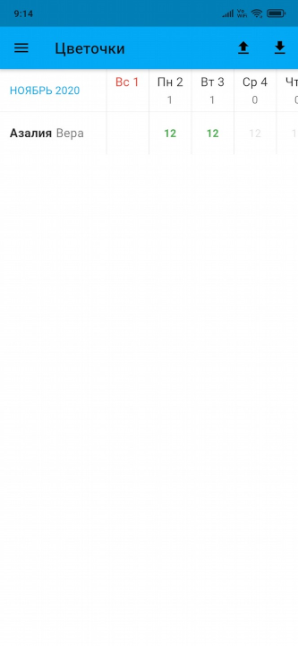

#### 28. Выберите табель на телефоне

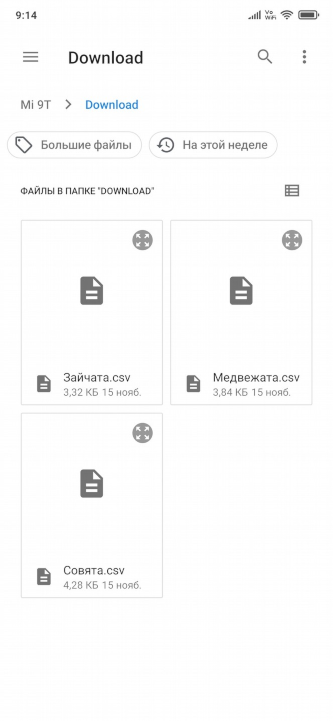

#### 29. Загружайте табели с телефона


#### 30. Сформируйте отчёт

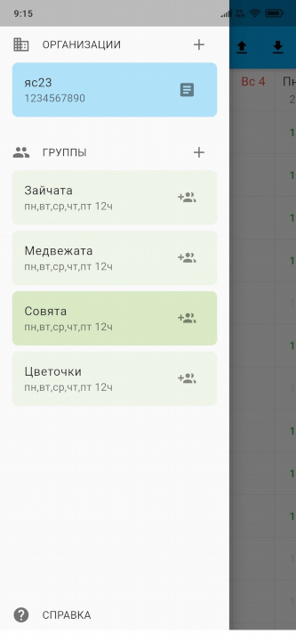

#### 31. Отчёт по группам

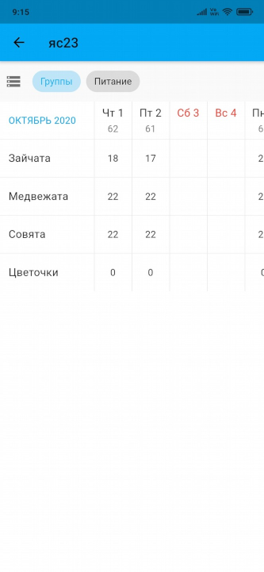

#### 32. Отчёт по питанию

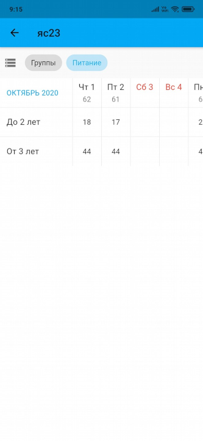

#### 33. Справка с видео и чатом

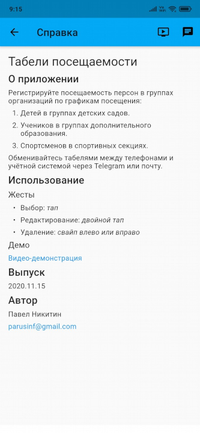

#### 34. Чат поддержки в WhatsApp

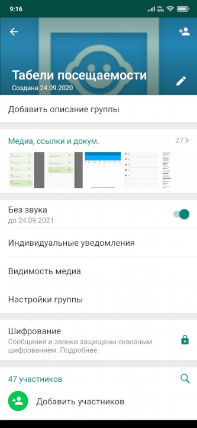
