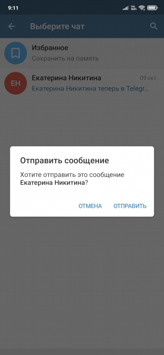
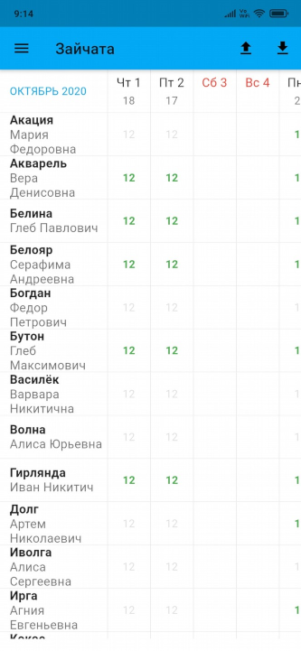

# Табели посещаемости

## 1. О программе

### 1.1. Предназначение

Программа предназначена для мобильной регистрации и обмена табелями посещаемости.

### 1.2. Область применения

Программа может использоваться в образовательных учреждениях.

### 1.3. Функциональные возможности
1. Мобильная регистрация табелей посещаемости персон в детсадах и дополнительном образовании.
2. Обмен табелями посещаемости в формате CSV между пользователями либо между пользователем и учётной системой через Telegram или электронную почту.
3. Формирование сводных отчётов по группам и по типам питания для заказа питания.

## 2. Жизненный цикл

### 2.1 Установка

#### 1. Android

1. Откройте на смартфоне приложение **Play Маркет**.
2. В строке поиска введите **Табели посещаемости**.
3. Выберите и установите приложение разработчика **Павел Никитин**.

Страница приложения в **Google Play** https://play.google.com/store/apps/details?id=ru.parusinf.timesheets

#### 2. iOS

1. Откройте на смартфоне приложение **App Store**.
2. В строке поиска введите **Табели посещаемости**.
3. Выберите и установите приложение разработчика **Pavel Nikitin**.

Страница приложения в **App Store** https://apps.apple.com/ru/app/id1548110226

#### 3. Android без Google Play

1. Скачайте на смартфон и запустите установочный файл https://github.com/parusinf/timesheets/releases/download/2021.3.5/timesheets.apk
2. На сообщении **Заблокировано Play Защитой** нажмите кнопку **ВСЕ РАВНО УСТАНОВИТЬ**.
3. При необходимости включите в настройках Android разрешение на установку из неизвестных источников. 

### 2.2. Процессы, обеспечивающие поддержание жизненного цикла Программного обеспечения

ТЕХНИЧЕСКАЯ ПОДДЕРЖКА обеспечивает процедуры по оцениванию и осуществлению:
1) обновления;
2) местоположения ошибок;
3) исправления, носимые в исходные коды («заплатки», «патчи»);

### 2.3. Устранение неисправностей, выявленных в ходе эксплуатации Программного обеспечения

ТЕХНИЧЕСКАЯ ПОДДЕРЖКА обеспечивает процедуры для решения проблем функционирования Программного обеспечения:
1. получения проблемы;
2. документирования проблемы;
3. оценивания проблемы;
4. принятия решения по проблеме;
5. отслеживания решения проблемы:
* по обратной связи в системе регистрации проблем https://github.com/parusinf/timesheets/issues
* по электронной почте _pavel@parusinf.ru_
* по телефону _+7 (916) 070-44-94_

Обратная связь документируется и оценивается с целью определения существования проблемы в выпущенном программном обеспечении. Любая такая проблема регистрируется в Отчёте о проблемах. Отчёт о проблемах включает в себя фактические или потенциальные неблагоприятные события и отклонения от спецификации.

## 3. Процессы совершенствования

ИЗГОТОВИТЕЛЬ осуществляет анализ модификации Программного обеспечения:
1) документирует и оценивает обратную связь;
2) осуществляет мониторинг обратной связи выпущенного Программного обеспечения от пользователей;
3) оценивает и одобряет Запросы на изменения, которые модифицируют выпущенное Программное обеспечение;
4) использует программный процесс разработки или установленный процесс ТЕХНИЧЕСКОЙ ПОДДЕРЖКИ для осуществления модификации Программного обеспечения.

## 4. Информация о персонале

Информация о персонале, необходимом для обеспечения поддержания жизненного цикла Программного обеспечения:

* Создание
* Техническая поддержка
* Совершенствование

выполнялись и осуществляются в настоящий момент силами ИЗГОТОВИТЕЛЯ - индивидуального предпринимателя Никитина Павла Александровича, который обладает необходимым набором знаний для работы со всеми компонентами, входящими в состав Программного обеспечения, при решении прикладных задач, соответствующих функционалу Программного обеспечения.

## 5. Ссылки

При внедрении задач по автоматизации и создании проектно-эксплуатационной документации ИЗГОТОВИТЕЛЬ руководствуется требованиями следующих нормативных документов:

* ГОСТ 34.602-89. Техническое задание. Требования к содержанию и оформлению.
* ГОСТ 34.201-89. Информационная технология. Комплекс стандартов на автоматизированные системы. Виды, комплексность и обозначение документов при создании автоматизированных систем.
* РД 50-34.698-90. Информационная технология. Комплекс стандартов и руководящих документов на автоматизированные системы. Требования к содержанию документов.
* ГОСТ 34.603-92. Информационная технология. Виды испытаний автоматизированных систем.

## 6. Использование

### 6.1 Жесты

* Выбор: _тап_
* Редактирование: _двойной тап_
* Удаление: _свайп влево или вправо_

### 6.2 Демо
Видео-демонстрация https://youtu.be/vvLaug6BrWo

### 6.3 Обучение

#### 1. Добавьте организацию

#### 2. Добавление организации

#### 3. Добавьте группу

#### 4. Добавление группы

#### 5. Добавьте график

#### 6. Добавление графика

#### 7. Выберите график

#### 8. Выберите питание в группе

#### 9. Добавьте персону в группу

#### 10. Прикрепите персону к группе

#### 11. Добавьте персону

#### 12. Добавление персоны

#### 13. Звонок персоне из приложения

#### 14. Выберите персону

#### 15. Определите срок прикрепления

#### 16. Список персон в группе

#### 17. Выберите месяц

#### 18. Заполните табель посещаемости

#### 19. Отправьте табель через Telegram

#### 20. Выберите получателя

#### 21. Удалите посещаемость

#### 22. Удалите персону из группы

#### 23. Удалите группу

#### 24. Удалите организацию

#### 25. Откройте Telegram

#### 26. Нажмите на файл в Telegram

> _Для iPhone файл нужно сохранить из Telegram на телефон, затем загрузить его в приложении._

#### 27. Загруженный из Telegram табель

#### 28. Выберите табель на телефоне

#### 29. Загружайте табели с телефона

#### 30. Сформируйте отчёт

#### 31. Отчёт по группам

#### 32. Отчёт по питанию

#### 33. Справка с видео и чатом

#### 34. Чат поддержки в WhatsApp

